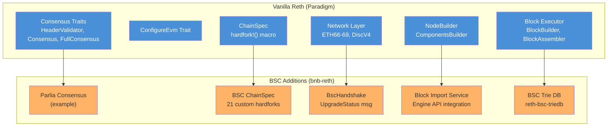
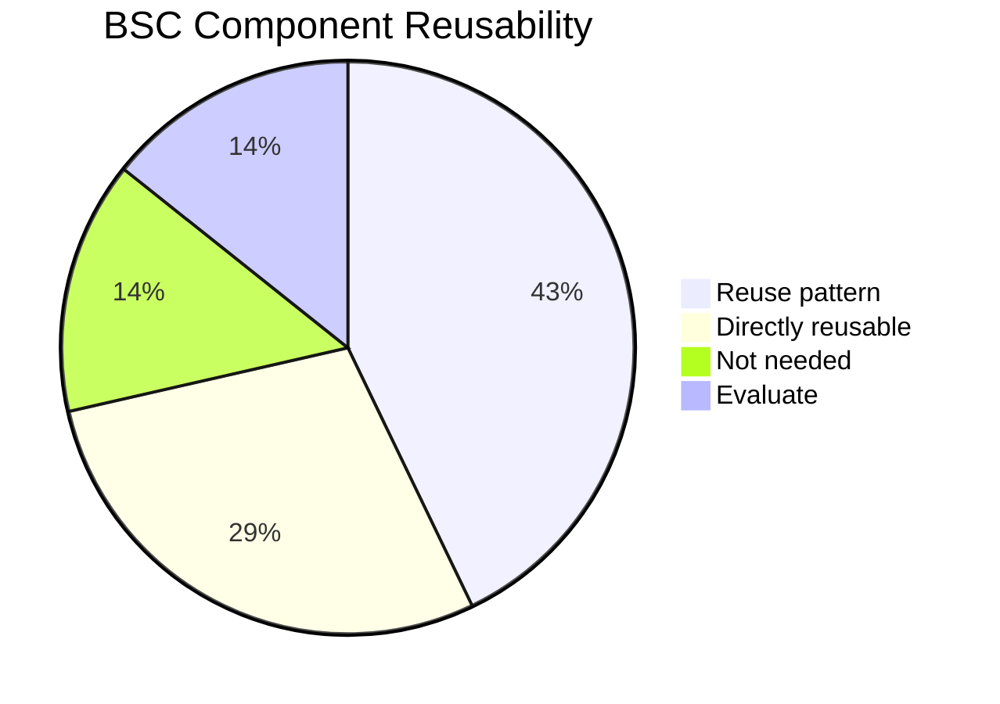

# BSC Architecture in kub-reth

## Overview

kub-reth is forked from bnb-reth (BSC's Reth implementation). This document analyzes what BSC built on top of vanilla reth, what can be reused for KubChain, and what must be replaced.

## BSC Additions to Reth



## Component Analysis

### 1. Parlia Consensus (Example)

**Location**: `examples/bsc-p2p/src/block_import/parlia.rs`

BSC's consensus (Parlia) is implemented as an example, not a full production crate:

```rust
pub struct ParliaConsensus<P> {
    provider: P,
}
```

**Canonical head rule**: Follow highest block number; for same height, pick lower hash.

**Reusability for KubChain**: **Pattern only**. The struct pattern and trait implementation approach are useful references, but the actual consensus logic is completely different:

| Aspect | BSC Parlia | KubChain PoSA |
|--------|-----------|---------------|
| Head selection | Highest block, lower hash | In-turn signer priority (diff=2 > diff=1) |
| Validator rotation | Epoch-based (BSC epochs) | Span-based (configurable N blocks) |
| Block time | Fixed 3s | Configurable, changed at Basel fork |
| Super node | No | Yes (Basel onwards) |
| System contracts | BSC-specific | StakeManager, SlashManager, ValidatorSet |
| Slashing | BSC rules | Span-based, single-slash-per-span |
| Reward distribution | BSC system | Fees → SystemAddress → StakeManager |

### 2. Custom Chain Spec with Hardforks

**Location**: `examples/bsc-p2p/src/chainspec.rs`

BSC defines 21 custom hardforks using the `hardfork!()` macro:

```rust
hardfork!(
    BscHardfork {
        Ramanujan, Niels, MirrorSync, Bruno, Euler,
        Nano, Moran, Gibbs, Planck, Luban, Plato,
        Hertz, HertzFix, Kepler, Feynman, FeynmanFix,
        Haber, HaberFix, Bohr, Pascal, Prague,
    }
);
```

**Reusability**: **Directly reusable pattern**. KubChain will use the same `hardfork!()` macro to define its 5 custom forks.

### 3. BscHandshake (P2P Extension)

**Location**: `examples/bsc-p2p/src/handshake.rs`

BSC extends the standard Ethereum handshake with an `UpgradeStatus` message:

```rust
impl EthRlpxHandshake for BscHandshake {
    fn handshake(&self, unauth, status, fork_filter, timeout_limit) -> ... {
        // 1. Standard Ethereum handshake
        // 2. BSC UpgradeStatus exchange (for ETH > 66)
    }
}
```

**Reusability**: **Not needed**. KubChain's bkc nodes use standard Ethereum ETH66 handshake without extensions. We don't need a custom handshake.

### 4. Block Import Service

**Location**: `examples/bsc-p2p/src/block_import/service.rs`

```rust
pub struct ImportService<Provider, T> {
    engine: ConsensusEngineHandle<T>,
    consensus: Arc<ParliaConsensus<Provider>>,
    from_network: UnboundedReceiver<IncomingBlock<T>>,
    to_network: UnboundedSender<ImportEvent<T>>,
    pending_imports: FuturesUnordered<...>,
}
```

**Flow**: Network → ImportService → Engine API (new_payload + fork_choice_updated)

**Reusability**: **Pattern reusable**. The async import service pattern with engine API integration is the same pattern KubChain needs, but with different consensus rules for canonical head selection.

### 5. BSC Trie Database

**Location**: External dependency `reth-bsc-triedb` from GitHub

```toml
rust-eth-triedb = { git = "https://github.com/bnb-chain/reth-bsc-triedb.git", tag = "v0.0.1" }
```

**Reusability**: **Evaluate**. KubChain uses standard Ethereum MPT (Merkle Patricia Trie). The BSC trie DB may have optimizations useful for KubChain, but the standard reth trie implementation should work. This can be evaluated during testing.

## Reuse Summary



| Component | Verdict | Action |
|-----------|---------|--------|
| `hardfork!()` macro | Directly reusable | Use same macro for KubHardfork |
| ComponentsBuilder | Directly reusable | Create KubNode with same pattern |
| Chain spec pattern | Reuse pattern | Create KubChainSpec following BSC example |
| Block import service | Reuse pattern | Create KubImportService with PoSA rules |
| Parlia consensus | Reuse pattern | Create KubConsensus (different logic) |
| BscHandshake | Not needed | Use standard Ethereum handshake |
| BSC trie DB | Evaluate | Test with standard reth trie first |

## What Must Be Built from Scratch

1. **KubConsensus** crate - Full PoSA implementation
2. **System contract bindings** - alloy-sol-types ABIs for StakeManager, SlashManager, ValidatorSet
3. **Snapshot system** - Span-based validator snapshots with LRU + DB
4. **Hardfork migrations** - Lausanne/Basel state changes (contract deploy + storage updates)
5. **Extra-data codec** - Encode/decode validator list + system contracts in header extra-data
6. **Validator selection** - Weighted random with binary search using block hash seed
7. **System transaction builder** - Create and inject zero-gas consensus transactions

## Source Reference

| BSC Component | Location |
|---------------|----------|
| Parlia consensus | `examples/bsc-p2p/src/block_import/parlia.rs` |
| BSC chain spec | `examples/bsc-p2p/src/chainspec.rs` |
| BSC handshake | `examples/bsc-p2p/src/handshake.rs` |
| Upgrade status | `examples/bsc-p2p/src/upgrade_status.rs` |
| Block import service | `examples/bsc-p2p/src/block_import/service.rs` |
| BSC main entry | `examples/bsc-p2p/src/main.rs` |
| BSC trie DB | `Cargo.toml` (lines 465-467) |

| Reth Core (reusable) | Location |
|----------------------|----------|
| Consensus traits | `crates/consensus/consensus/src/lib.rs` |
| EthBeaconConsensus | `crates/ethereum/consensus/src/lib.rs` |
| ConfigureEvm | `crates/evm/evm/src/lib.rs` |
| ChainSpec | `crates/chainspec/src/lib.rs` |
| NodeBuilder | `crates/node/builder/` |
| EthereumNode | `crates/ethereum/node/src/node.rs` |
| Network manager | `crates/net/network/` |
| EthVersion | `crates/net/eth-wire-types/src/version.rs` |
