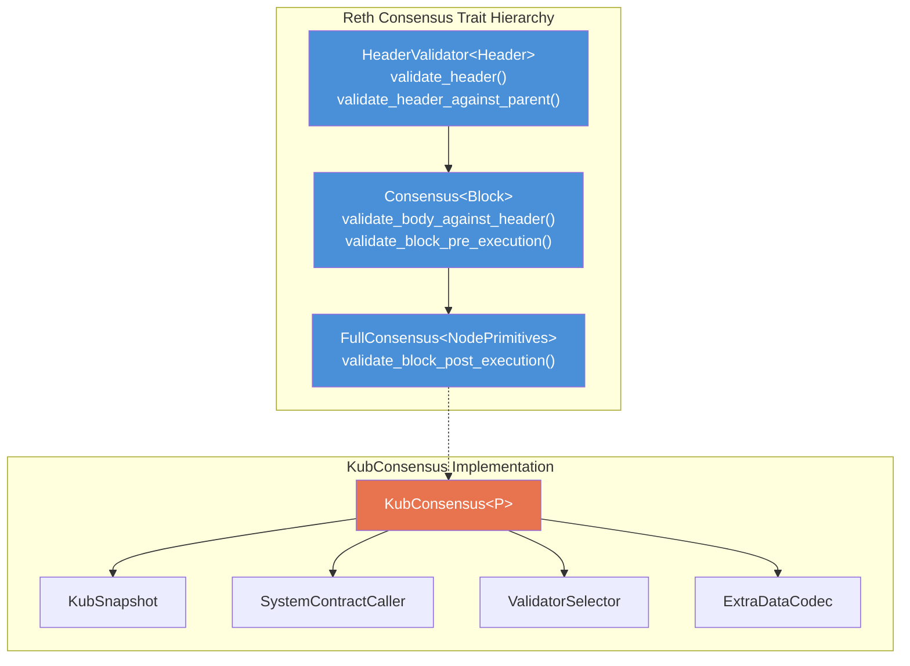
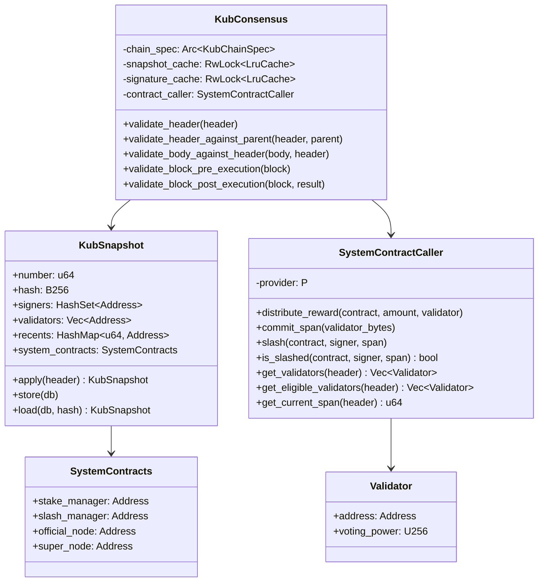
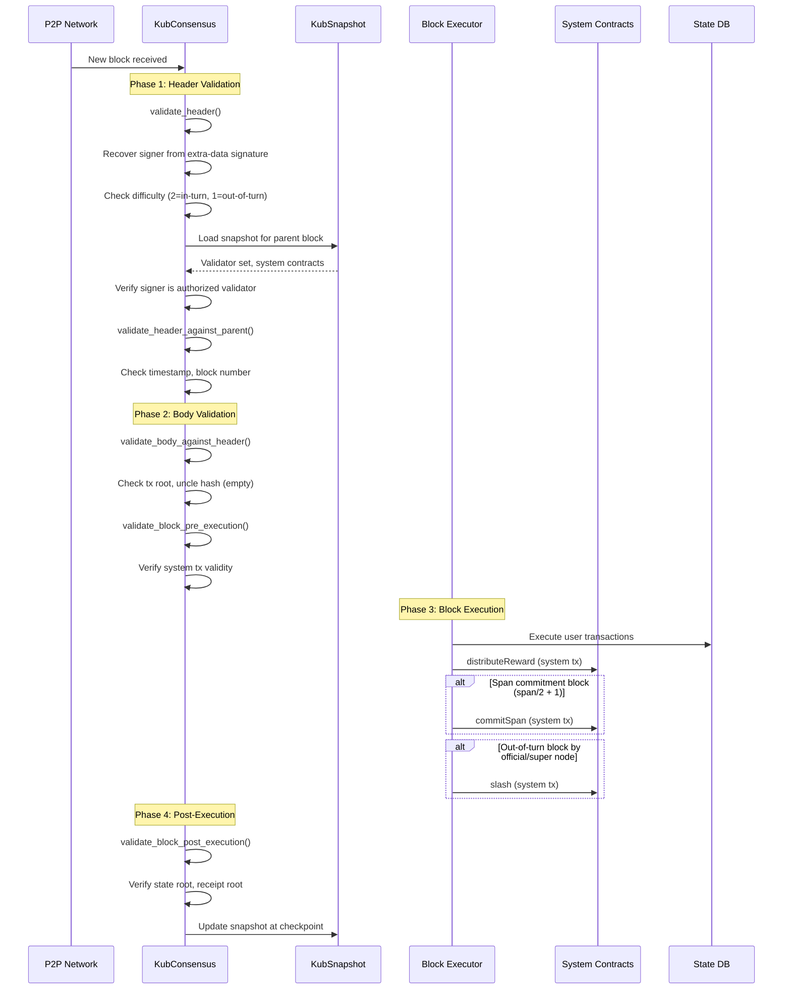
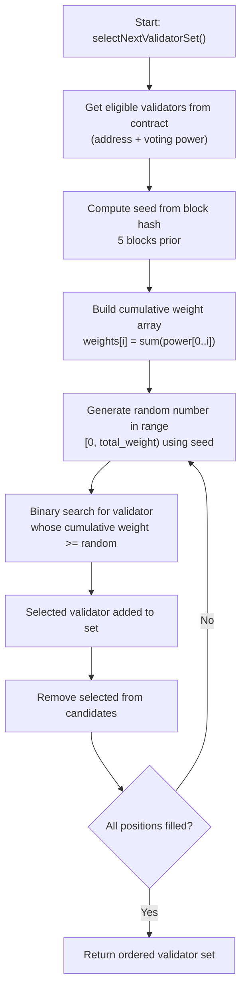
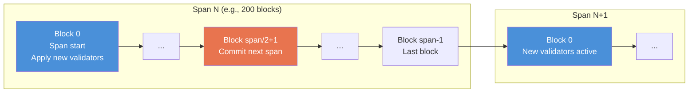
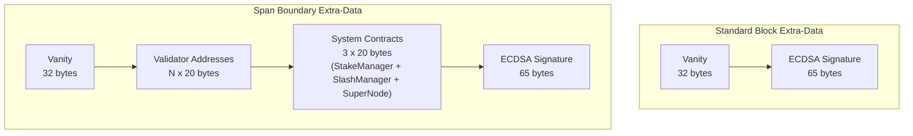
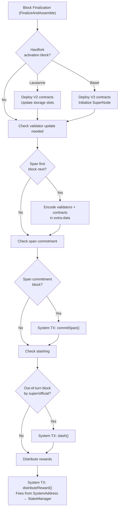

# KubChain Consensus Design

## Overview

KubChain uses a Proof-of-Staked-Authority (PoSA) consensus, originally built on top of Go-Ethereum's Clique PoA engine. This document describes how to implement it in Rust as a pluggable module for reth.

## Architecture



## Go-to-Rust Mapping

### Core Struct

```
bkc: consensus/clique/clique.go → Clique struct
rust: crates/kubchain/consensus/src/lib.rs → KubConsensus<P>
```



## Block Lifecycle



## Validator Selection Algorithm

The weighted random validator selection (from `bkc/consensus/clique/clique.go:1390-1441`):



## Span Management



**Key timing:**
- **Span first block** (`block_number % span == 0`): New validator set becomes active
- **Span commitment block** (`block_number % span == span/2 + 1`): Commit next validator set via contract
- **Validator update check**: At blocks before span first block, encode validators in extra-data

## Extra-Data Format



## Difficulty Rules

| Condition | Difficulty | Description |
|-----------|-----------|-------------|
| In-turn signer | 2 (`DIFF_IN_TURN`) | Authorized validator for this slot |
| Out-of-turn signer | 1 (`DIFF_NO_TURN`) | Fallback/super node signing |

Pre-PoSA (before Chaophraya): Standard Clique recent-signer check prevents validator spam.
Post-PoSA: Simplified with delay mechanics. SuperNode permitted out-of-turn without restriction.

## System Transactions

Zero-gas transactions injected during block finalization:



## Snapshot Persistence

- **Checkpoint interval**: Every 1024 blocks
- **In-memory cache**: LRU with 128 entries
- **Signature cache**: LRU with 4096 entries for signer recovery
- **DB storage**: Persist snapshots to MDBX for durability
- **Snapshot fields**: Number, Hash, Signers, Validators, Recents, SystemContracts

## Source Reference

| Component | bkc File | Lines |
|-----------|----------|-------|
| Core consensus | `consensus/clique/clique.go` | All (1,619 lines) |
| Snapshot | `consensus/clique/snapshot.go` | All |
| Contract client | `consensus/clique/contract/client.go` | All |
| ABI definitions | `consensus/clique/contract/abi.go` | All |
| Contract interface | `consensus/clique/contract_client.go` | 18-87 |
| SystemContracts type | `consensus/clique/ctypes/common.go` | 15-20 |
| Validator selection | `consensus/clique/clique.go` | 1390-1441 |
| Block finalization | `consensus/clique/clique.go` | 817-938 |
| Slashing | `consensus/clique/clique.go` | 1115-1141 |
| Reward distribution | `consensus/clique/clique.go` | 1143-1155 |
| Span commitment | `consensus/clique/clique.go` | 1157-1176 |
