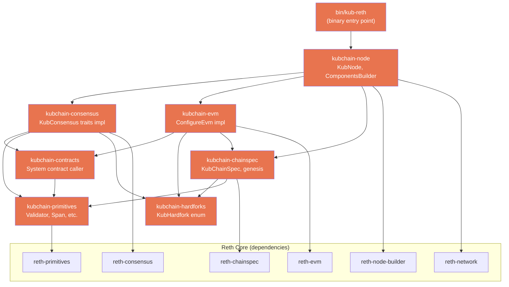
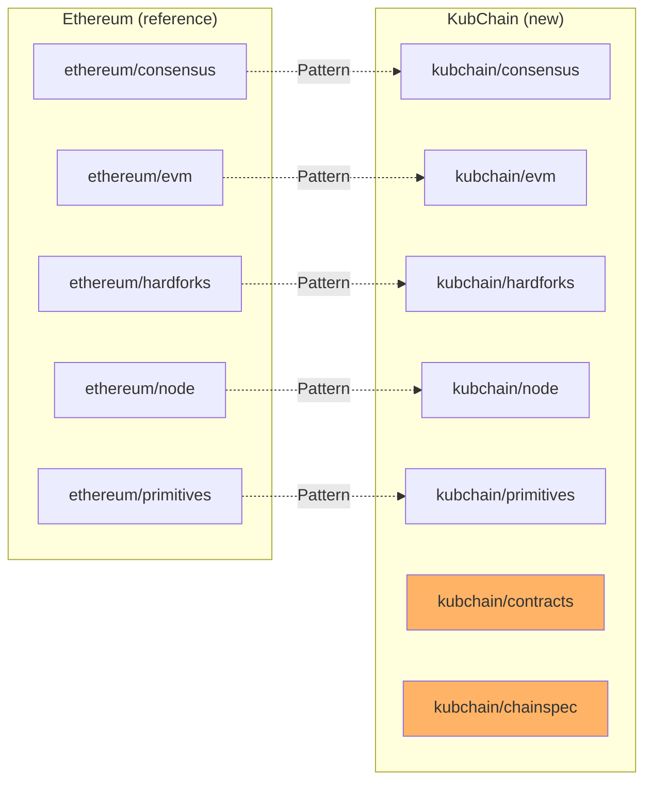
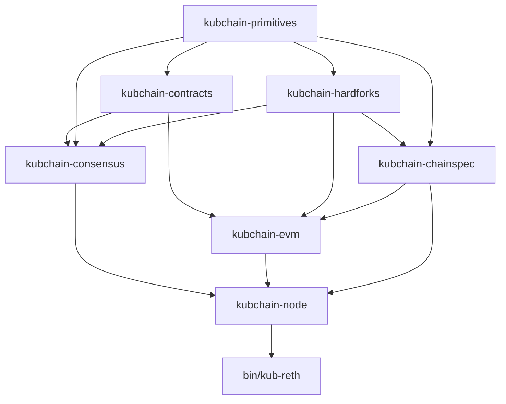

# KubChain Crate Structure

## Overview

The KubChain implementation is organized as a set of crates under `crates/kubchain/`, following the same modular pattern as reth's `crates/ethereum/`.

## Crate Dependency Graph



## Crate Details

### `kubchain-primitives`

Core types shared across all kubchain crates.

```
crates/kubchain/primitives/
├── Cargo.toml
└── src/
    ├── lib.rs
    └── types.rs
```

**Types:**
- `Validator { address: Address, voting_power: U256 }`
- `SystemContracts { stake_manager, slash_manager, official_node, super_node }`
- `SpanConfig { span: u64 }`
- `MinimalVal` (for RLP encoding in span commitment)
- Constants: `SYSTEM_ADDRESS`, `DIFF_IN_TURN`, `DIFF_NO_TURN`, `CHECKPOINT_INTERVAL`

**Dependencies:** `alloy-primitives`, `reth-primitives`

---

### `kubchain-hardforks`

Custom hardfork definitions using reth's `hardfork!()` macro.

```
crates/kubchain/hardforks/
├── Cargo.toml
└── src/
    ├── lib.rs     # KubHardfork enum
    └── dev.rs     # Dev/test hardfork schedules
```

**Exports:**
- `KubHardfork` enum: `Erawan`, `Chaophraya`, `ChaophrayaBangkok`, `Lausanne`, `Basel`
- `KUB_DEV_HARDFORKS` - All forks at block 0 for development

**Dependencies:** `reth-chainspec`

---

### `kubchain-chainspec`

Chain specification including genesis and hardfork schedules.

```
crates/kubchain/chainspec/
├── Cargo.toml
└── src/
    ├── lib.rs          # KubChainSpec type
    ├── mainnet.rs      # Mainnet config
    ├── testnet.rs      # Testnet config
    └── genesis.json    # Genesis allocation
```

**Exports:**
- `KubChainSpec` (wrapper around `ChainSpec` with KubChain-specific fields like `Span`)
- `kub_mainnet_chain_spec()` / `kub_testnet_chain_spec()`
- `KubChainSpecParser` for CLI argument parsing
- Genesis JSON with pre-deployed system contracts

**Dependencies:** `reth-chainspec`, `kubchain-hardforks`, `kubchain-primitives`

---

### `kubchain-contracts`

System contract ABI bindings and EVM-based contract caller.

```
crates/kubchain/contracts/
├── Cargo.toml
└── src/
    ├── lib.rs              # SystemContractCaller
    ├── abi.rs              # ABI definitions
    ├── stake_manager.rs    # StakeManager interactions
    ├── slash_manager.rs    # SlashManager interactions
    ├── validator_set.rs    # ValidatorSet interactions
    └── types.rs            # Return types
```

**Key interfaces:**
```rust
pub trait SystemContractCaller {
    // Read-only calls (via EVM staticcall)
    fn get_validators(&self, header: &Header) -> Result<(Vec<Validator>, SystemContracts)>;
    fn get_eligible_validators(&self, header: &Header) -> Result<Vec<Validator>>;
    fn get_current_span(&self, header: &Header) -> Result<u64>;
    fn is_slashed(&self, contract: Address, signer: Address, span: u64) -> Result<bool>;

    // State-modifying calls (system transactions)
    fn distribute_reward(&self, contract: Address, amount: U256, validator: Address) -> Transaction;
    fn commit_span(&self, validator_bytes: Bytes) -> Transaction;
    fn slash(&self, contract: Address, signer: Address, span: u64) -> Transaction;
}
```

**ABI definitions** using `alloy-sol-types`:
- `StakeManagerABI`: distributeReward, stakeManagerStorage, stakeManagerVault, nftContract, kkub
- `ValidatorSetABI`: commitSpan, currentSpanNumber, getValidators, getEligibleValidators
- `SlashManagerABI`: slash, isSignerSlashed

**Dependencies:** `alloy-sol-types`, `alloy-primitives`, `revm`, `kubchain-primitives`

---

### `kubchain-consensus`

Core consensus implementation.

```
crates/kubchain/consensus/
├── Cargo.toml
└── src/
    ├── lib.rs              # KubConsensus struct + trait impls
    ├── validation.rs       # Header & block validation rules
    ├── snapshot.rs         # Validator snapshot management
    ├── validator.rs        # Weighted random validator selection
    ├── extra_data.rs       # Extra-data encoding/decoding
    ├── system_tx.rs        # System transaction creation
    └── error.rs            # Consensus error types
```

**Trait implementations:**
- `HeaderValidator<Header>` for `KubConsensus`
- `Consensus<EthBlock>` for `KubConsensus`
- `FullConsensus<EthPrimitives>` for `KubConsensus`

**Dependencies:** `reth-consensus`, `kubchain-contracts`, `kubchain-primitives`, `kubchain-hardforks`

---

### `kubchain-evm`

Custom EVM configuration with system transaction injection.

```
crates/kubchain/evm/
├── Cargo.toml
└── src/
    ├── lib.rs          # KubEvmConfig implementing ConfigureEvm
    ├── execute.rs      # Block executor with system tx injection
    ├── hardfork.rs     # Hardfork state migrations (Lausanne, Basel)
    └── spec.rs         # SpecId mapping for KubChain
```

**Key trait implementations:**
- `ConfigureEvm` for `KubEvmConfig`
- Custom `BlockExecutorFactory` that injects system transactions during finalization
- Custom `BlockAssembler` that handles extra-data and reward distribution

**Hardfork migrations:**
- `apply_lausanne_hardfork(state)` - Deploy V2 contracts, update storage
- `apply_basel_hardfork(state)` - Deploy V3 contracts, initialize SuperNode

**Dependencies:** `reth-evm`, `revm`, `kubchain-contracts`, `kubchain-hardforks`, `kubchain-chainspec`

---

### `kubchain-node`

Node type definition and component assembly.

```
crates/kubchain/node/
├── Cargo.toml
└── src/
    ├── lib.rs          # KubNode implementing NodeTypes
    └── builder.rs      # KubConsensusBuilder, KubExecutorBuilder, etc.
```

**Node type:**
```rust
pub struct KubNode;

impl NodeTypes for KubNode {
    type Primitives = EthPrimitives;
    type ChainSpec = KubChainSpec;
    type Storage = EthStorage;
    type Payload = KubEngineTypes;
}
```

**Component builders:**
- `KubConsensusBuilder` → creates `KubConsensus` instance
- `KubExecutorBuilder` → creates `KubEvmConfig` block executor
- `KubPayloadBuilder` → creates payload builder with system tx injection
- Reuses `EthereumPoolBuilder` and `EthereumNetworkBuilder`

**Dependencies:** `reth-node-builder`, all kubchain crates

---

### `bin/kub-reth`

Binary entry point.

```
bin/kub-reth/
├── Cargo.toml
└── src/
    └── main.rs
```

```rust
fn main() {
    Cli::<KubChainSpecParser>::parse().run(async move |builder, _| {
        let NodeHandle { node, node_exit_future } =
            builder.node(KubNode::default()).launch().await?;
        node_exit_future.await
    })
}
```

**Dependencies:** `kubchain-node`, `reth-cli`

## Comparison with Ethereum Crates



**KubChain adds** `kubchain-contracts` (system contract interactions, not needed in vanilla Ethereum) and `kubchain-chainspec` (KubChain-specific chain config with span, validator contract addresses).

## Build Order



Each crate can be built and tested independently, enabling parallel development.
