# EVM Compatibility

## Overview

bkc runs a London-equivalent EVM (EIP-1559) with custom hardforks for PoSA features. reth supports all Ethereum hardforks from Frontier through Prague. The strategy is to configure reth's hardfork schedule to match bkc exactly, omitting post-London features and adding KubChain-specific forks.

## Hardfork Schedule Comparison

```mermaid
gantt
    title Ethereum Hardfork Support
    dateFormat X
    axisFormat %s

    section Standard Forks (Both)
    Frontier - Petersburg : done, 0, 1
    Istanbul : done, 1, 2
    MuirGlacier : done, 2, 3
    Berlin : done, 3, 4
    London : done, 4, 5
    ArrowGlacier : done, 5, 6

    section Not in bkc (Omit)
    Shanghai : crit, 6, 7
    Cancun : crit, 7, 8
    Prague : crit, 8, 9

    section KubChain Custom
    Erawan : active, 10, 11
    Chaophraya (PoSA) : active, 11, 12
    Lausanne (V2) : active, 12, 13
    Basel (SuperNode) : active, 13, 14
```



## Chain Hardfork Configuration

### Standard Ethereum Forks (from `bkc/params/config.go`)

| Fork | Config Field | Purpose | Include? |
|------|-------------|---------|----------|
| Homestead | `HomesteadBlock` | Early EVM | Yes |
| DAO | `DAOForkBlock` | DAO fix | Yes |
| EIP-150 (Tangerine) | `EIP150Block` | Gas cost changes | Yes |
| EIP-155 | `EIP155Block` | Replay protection | Yes |
| EIP-158 (Spurious Dragon) | `EIP158Block` | State clearing | Yes |
| Byzantium | `ByzantiumBlock` | REVERT opcode | Yes |
| Constantinople | `ConstantinopleBlock` | Gas optimizations | Yes |
| Petersburg | `PetersburgBlock` | Constantinople fix | Yes |
| Istanbul | `IstanbulBlock` | EIP-1344, 1014, 1087 | Yes |
| MuirGlacier | `MuirGlacierBlock` | Difficulty bomb delay | Yes |
| Berlin | `BerlinBlock` | EIP-2718, 2930 | Yes |
| London | `LondonBlock` | EIP-1559 base fee | Yes |
| ArrowGlacier | `ArrowGlacierBlock` | Difficulty bomb delay | Yes |
| Shanghai | - | Withdrawals | **No** |
| Cancun | - | Blobs, 4844 | **No** |
| Prague | - | Pectra | **No** |

### Custom KubChain Forks

| Fork | Purpose | State Changes |
|------|---------|---------------|
| **Erawan** | Modified voting logic | Voting rule changes |
| **Chaophraya** | PoSA activation | Enables span-based consensus, system contracts |
| **ChaophrayaBangkok** | Testnet PoSA variant | Testnet-specific PoSA params |
| **Lausanne** | Contract V2 upgrade | Deploys StakeManagerV2, SlashManagerV2, updates storage |
| **Basel** | SuperNode introduction | Deploys V3 contracts, converts official→super node |

## Implementation Pattern

Using reth's `hardfork!()` macro (same pattern as BSC in `examples/bsc-p2p/src/chainspec.rs`):

```rust
// crates/kubchain/hardforks/src/lib.rs
use reth_chainspec::{hardfork, Hardfork};

hardfork!(
    /// KubChain-specific hardforks.
    ///
    /// Mixed with `EthereumHardfork` in the chain's hardfork schedule.
    KubHardfork {
        /// Modified voting logic
        Erawan,
        /// PoSA consensus activation (mainnet)
        Chaophraya,
        /// PoSA consensus activation (testnet Bangkok)
        ChaophrayaBangkok,
        /// StakeManager/SlashManager V2 upgrade
        Lausanne,
        /// SuperNode introduction, V3 contracts
        Basel,
    }
);
```

## Hardfork Schedule Assembly

```rust
fn kub_mainnet_hardforks() -> ChainHardforks {
    ChainHardforks::new(vec![
        // Standard Ethereum forks
        (EthereumHardfork::Frontier.boxed(), ForkCondition::Block(0)),
        (EthereumHardfork::Homestead.boxed(), ForkCondition::Block(HOMESTEAD_BLOCK)),
        (EthereumHardfork::Dao.boxed(), ForkCondition::Block(DAO_BLOCK)),
        (EthereumHardfork::Tangerine.boxed(), ForkCondition::Block(EIP150_BLOCK)),
        (EthereumHardfork::SpuriousDragon.boxed(), ForkCondition::Block(EIP158_BLOCK)),
        (EthereumHardfork::Byzantium.boxed(), ForkCondition::Block(BYZANTIUM_BLOCK)),
        (EthereumHardfork::Constantinople.boxed(), ForkCondition::Block(CONSTANTINOPLE_BLOCK)),
        (EthereumHardfork::Petersburg.boxed(), ForkCondition::Block(PETERSBURG_BLOCK)),
        (EthereumHardfork::Istanbul.boxed(), ForkCondition::Block(ISTANBUL_BLOCK)),
        (EthereumHardfork::MuirGlacier.boxed(), ForkCondition::Block(MUIR_GLACIER_BLOCK)),
        (EthereumHardfork::Berlin.boxed(), ForkCondition::Block(BERLIN_BLOCK)),
        (EthereumHardfork::London.boxed(), ForkCondition::Block(LONDON_BLOCK)),
        (EthereumHardfork::ArrowGlacier.boxed(), ForkCondition::Block(ARROW_GLACIER_BLOCK)),
        // NO Shanghai, Cancun, or Prague

        // KubChain custom forks
        (KubHardfork::Erawan.boxed(), ForkCondition::Block(ERAWAN_BLOCK)),
        (KubHardfork::Chaophraya.boxed(), ForkCondition::Block(CHAOPHRAYA_BLOCK)),
        (KubHardfork::Lausanne.boxed(), ForkCondition::Block(LAUSANNE_BLOCK)),
        (KubHardfork::Basel.boxed(), ForkCondition::Block(BASEL_BLOCK)),
    ])
}
```

## Hardfork State Migrations

### Lausanne Migration (from `bkc/consensus/clique/hardfork/lausanne/instruction.go`)

At `LausanneBlock`, the following state changes are applied:

1. Deploy `StakeManagerV2` contract code
2. Deploy `StakeManagerStorageV2` contract code
3. Deploy `SlashManagerV2` contract code
4. Update storage slots:
   - Slot 24: `SoloSlashRate`
   - Slot 25-27: Minimum stake values
   - Slot 28: `SlashThreshold`
   - Slot 29: `SlashEpochSize`

### Basel Migration (from `bkc/consensus/clique/hardfork/basel/instruction.go`)

At `BaselBlock`, the following state changes are applied:

1. Convert official node (validator 0) to regular pool
2. Deploy V3 contract versions (StakeManagerV3, SlashManagerV3, etc.)
3. Initialize SuperNode role
4. Update 5 contracts' storage:
   - `StakeManagerV3` (6 slots)
   - `StakeManagerStorageV3` (12 slots)
   - `BKCValidatorSetV3` (1 slot)
   - `NftContractV3` (4 slots)
   - `OfficialNodeValidatorShare` (1 slot)

## EVM Spec ID Mapping

reth uses `SpecId` from revm to configure EVM behavior. The mapping:

| KubChain State | revm SpecId |
|---------------|-------------|
| Pre-Istanbul | `ISTANBUL` |
| Post-Istanbul, pre-Berlin | `ISTANBUL` |
| Post-Berlin, pre-London | `BERLIN` |
| Post-London (current) | `LONDON` |

Custom KubChain forks (Erawan, Chaophraya, etc.) do not change EVM opcodes -- they only affect consensus behavior and state migrations. The SpecId remains `LONDON` for current blocks.

## Base Fee Configuration

bkc implements EIP-1559 (London). The base fee parameters need to match:

```rust
// Match bkc's base fee behavior
base_fee_params: BaseFeeParamsKind::Constant(BaseFeeParams::new(
    base_fee_elasticity_multiplier,
    base_fee_change_denominator,
))
```

The exact parameters must be extracted from bkc's chain config (`params/config.go`).

## Source Reference

| Component | File | Lines |
|-----------|------|-------|
| Chain config | `bkc/params/config.go` | 387-393 (CliqueConfig) |
| Hardfork fields | `bkc/params/config.go` | 358-362 |
| Lausanne migration | `bkc/consensus/clique/hardfork/lausanne/instruction.go` | All |
| Basel migration | `bkc/consensus/clique/hardfork/basel/instruction.go` | All |
| reth hardfork macro | `kub-reth/crates/chainspec/` | hardfork!() macro |
| BSC example | `kub-reth/examples/bsc-p2p/src/chainspec.rs` | 12-59 |
