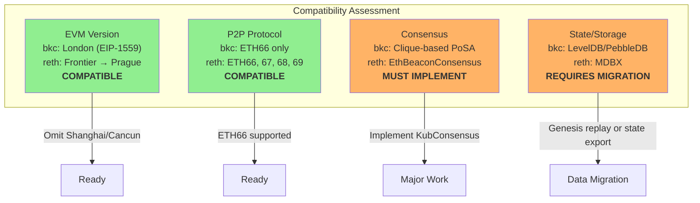
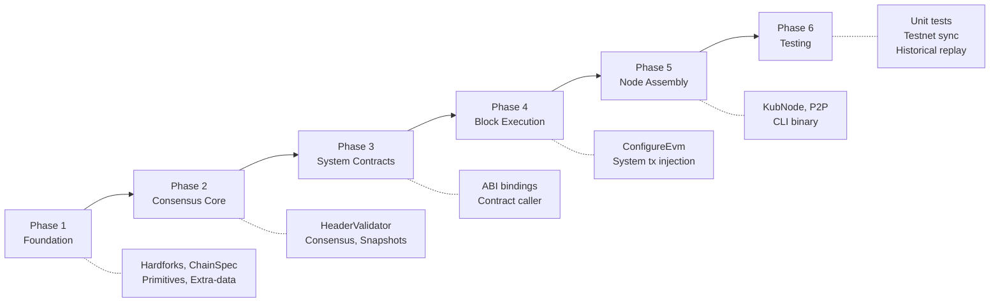

# KubChain Migration Overview

## Context

KubChain (formerly Bitkub Chain) runs on `bkc`, a Go-Ethereum fork from 2021 with a custom Proof-of-Staked-Authority (PoSA) consensus. This migration moves the execution client to `kub-reth`, a Rust-based implementation forked from bnb-reth (BSC's Reth).

## Why Migrate?

- **Performance**: Rust's memory safety and zero-cost abstractions provide better throughput
- **Modularity**: Reth's trait-based architecture allows clean separation of consensus, EVM, and networking
- **Maintainability**: Easier to track upstream Ethereum improvements
- **Single binary**: Like the legacy geth, reth operates as a single binary (no beacon chain dependency)

## Compatibility Matrix

## Migration Strategy

## Detailed Compatibility

### EVM Version

| Feature | bkc (geth) | kub-reth (reth) | Action |
|---------|-----------|-----------------|--------|
| Homestead → Istanbul | Enabled | Supported | Include in hardfork schedule |
| Berlin (EIP-2718, 2930) | Enabled | Supported | Include in hardfork schedule |
| London (EIP-1559) | Enabled | Supported | Include in hardfork schedule |
| ArrowGlacier | Enabled | Supported | Include in hardfork schedule |
| Shanghai (withdrawals) | Not enabled | Available | Omit from schedule |
| Cancun (blobs, 4844) | Not enabled | Available | Omit from schedule |
| Custom: Erawan | Enabled | Not present | Define via `hardfork!()` macro |
| Custom: Chaophraya | Enabled | Not present | Define via `hardfork!()` macro |
| Custom: Lausanne | Enabled | Not present | Define via `hardfork!()` macro |
| Custom: Basel | Enabled | Not present | Define via `hardfork!()` macro |

### P2P Protocol

| Feature | bkc | kub-reth | Status |
|---------|-----|----------|--------|
| eth/66 | Only version | Supported | Compatible |
| Discovery v4 | Yes | Yes | Compatible |
| SNAP protocol | SNAP1 | Yes | Compatible |
| Fork ID | genesis + fork blocks | Configurable | Must match |

### Consensus

| Feature | bkc (Go) | kub-reth (Rust) | Migration Path |
|---------|---------|-----------------|----------------|
| Validator selection | Weighted random | N/A | Implement in `KubConsensus` |
| Span rotation | Every N blocks | N/A | Implement in `KubConsensus` |
| System contracts | StakeManager, SlashManager | N/A | ABI bindings + revm calls |
| System transactions | Zero-gas txs | N/A | Custom `BlockExecutor` |
| Reward distribution | Fees → StakeManager | N/A | System tx in finalization |
| Slashing | SlashManager contract | N/A | System tx in finalization |
| Snapshots | LRU + DB | N/A | Port to Rust |
| Extra-data | Validators + contracts | N/A | Custom codec |

## Key Risk Areas

1. **State root compatibility**: The state trie implementation must produce identical roots. reth uses MDBX while bkc uses LevelDB, but the trie algorithm (MPT) is the same.
2. **System transaction ordering**: System txs must be injected in the exact same order as bkc to produce matching state roots.
3. **Hardfork state migrations**: Lausanne and Basel deploy contract code and modify storage slots. These must be replicated exactly.
4. **Fork ID**: Must match existing network to peer successfully with bkc nodes.
