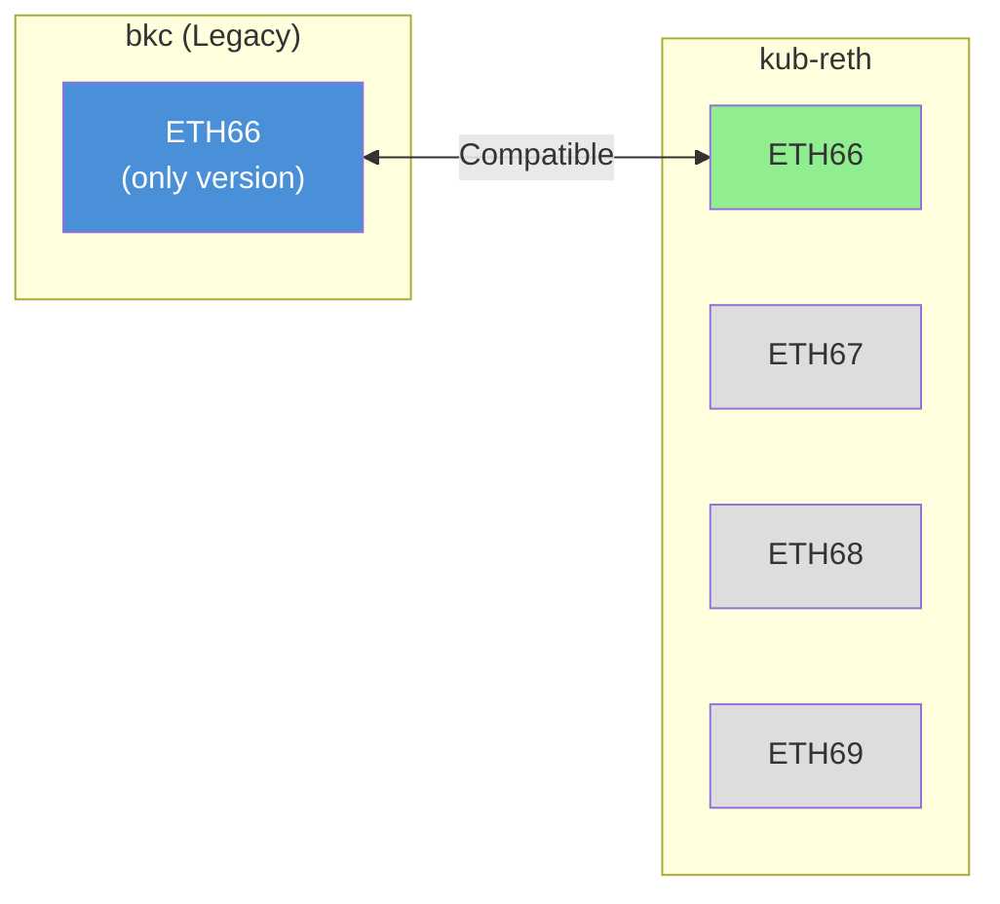
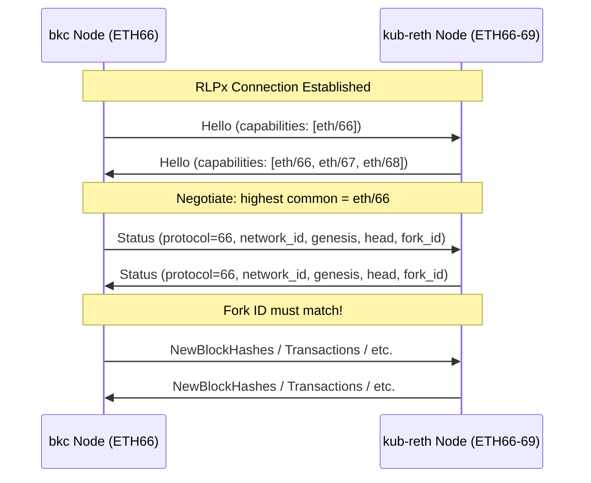
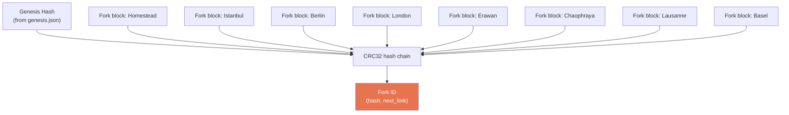
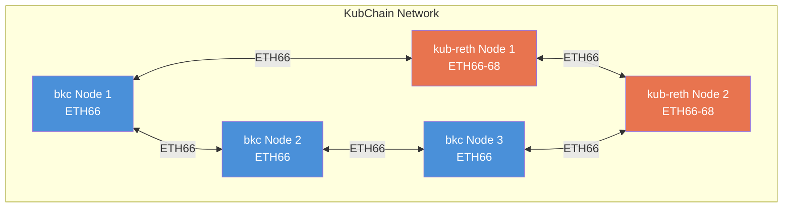

# P2P Protocol Compatibility

## Summary

bkc uses ETH66 exclusively. reth supports ETH66, 67, 68, and 69. Full P2P compatibility is confirmed.

## Protocol Version Analysis



## ETH66 in bkc

**File**: `bkc/eth/protocols/eth/protocol.go`

```go
const ETH66 = 66
var ProtocolVersions = []uint{ETH66}
var protocolLengths = map[uint]uint64{ETH66: 17}
```

17 message types:
- `StatusMsg (0x00)` - Handshake
- `NewBlockHashesMsg (0x01)` - Block hash announcements
- `TransactionsMsg (0x02)` - Transaction broadcast
- `GetBlockHeadersMsg (0x03)` / `BlockHeadersMsg (0x04)` - Header exchange
- `GetBlockBodiesMsg (0x05)` / `BlockBodiesMsg (0x06)` - Body exchange
- `NewBlockMsg (0x07)` - Full block broadcast
- `NewPooledTransactionHashesMsg (0x08)` - Tx pool hash announcements
- `GetPooledTransactionsMsg (0x09)` / `PooledTransactionsMsg (0x0a)` - Tx pool exchange
- `GetNodeDataMsg (0x0d)` / `NodeDataMsg (0x0e)` - State data (deprecated)
- `GetReceiptsMsg (0x0f)` / `ReceiptsMsg (0x10)` - Receipt exchange

## ETH66 in kub-reth

**File**: `kub-reth/crates/net/eth-wire-types/src/version.rs:21-37`

```rust
pub enum EthVersion {
    Eth66 = 66,
    Eth67 = 67,
    Eth68 = 68,
    Eth69 = 69,
}

impl EthVersion {
    pub const LATEST: Self = Self::Eth68;
    pub const ALL_VERSIONS: &'static [Self] = &[Self::Eth69, Self::Eth68, Self::Eth67, Self::Eth66];
}
```

reth negotiates the highest mutually supported protocol version during the RLPx handshake. When connecting to a bkc node that only supports ETH66, reth will negotiate down to ETH66.

## Handshake Flow



## Fork ID Compatibility

Fork ID (EIP-2124) is critical for peering. It's computed from:
1. Genesis block hash
2. List of fork block numbers (in ascending order)

**Both nodes must produce the same Fork ID to peer successfully.**



**Action**: The kub-reth chain spec must include all fork block numbers in the same order as bkc to produce a matching Fork ID.

## Discovery

| Feature | bkc | kub-reth | Notes |
|---------|-----|----------|-------|
| Protocol | DiscV4 | DiscV4 | Same protocol |
| Port | 30303 (default) | 30303 (default) | Same default |
| Boot nodes | KubChain enodes | Configurable | Must set KubChain boot nodes |
| ENR | Supported | Supported | Compatible |

## Network Configuration for kub-reth

```rust
// Configure network for KubChain compatibility
let net_cfg = NetworkConfig::builder(secret_key)
    .boot_nodes(kub_boot_nodes)     // KubChain boot nodes
    .set_head(current_head)          // Current chain head
    .listener_addr(listen_addr)      // Listen address (default :30303)
    .build(provider);

// Discovery V4 with KubChain boot nodes
let net_cfg = net_cfg.set_discovery_v4(
    Discv4ConfigBuilder::default()
        .add_boot_nodes(kub_boot_nodes)
        .build(),
);
```

## Mixed Network Considerations

During migration, the network will have both bkc and kub-reth nodes:



All nodes communicate via ETH66 regardless of implementation. Block propagation, transaction broadcast, and state sync work identically.

## Source Reference

| Component | File |
|-----------|------|
| bkc ETH66 protocol | `bkc/eth/protocols/eth/protocol.go` |
| bkc SNAP protocol | `bkc/eth/protocols/snap/protocol.go` |
| reth EthVersion enum | `kub-reth/crates/net/eth-wire-types/src/version.rs:21-37` |
| reth capability negotiation | `kub-reth/crates/net/eth-wire/src/capability.rs` |
| reth network config | `kub-reth/crates/net/network/` |
| reth DiscV4 | `kub-reth/crates/net/discv4/` |
