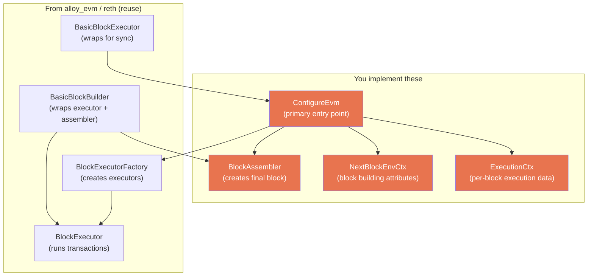
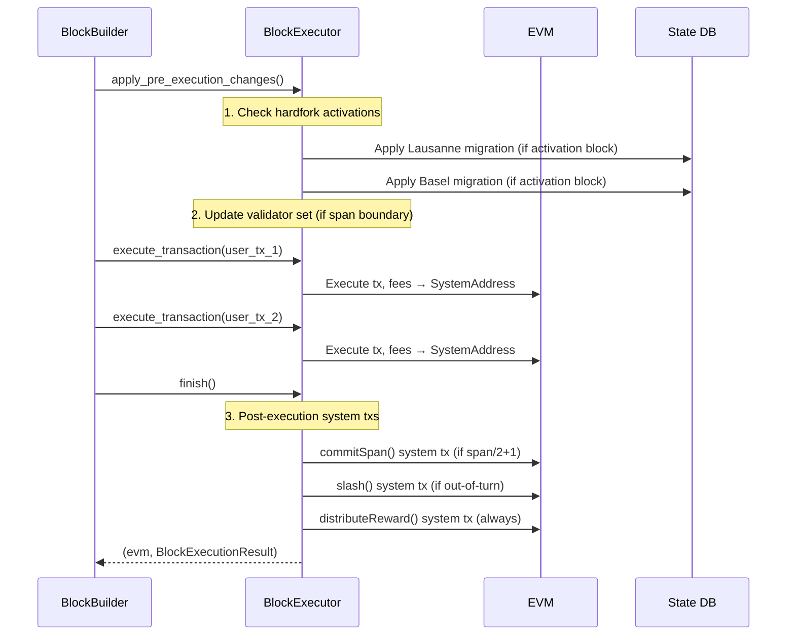
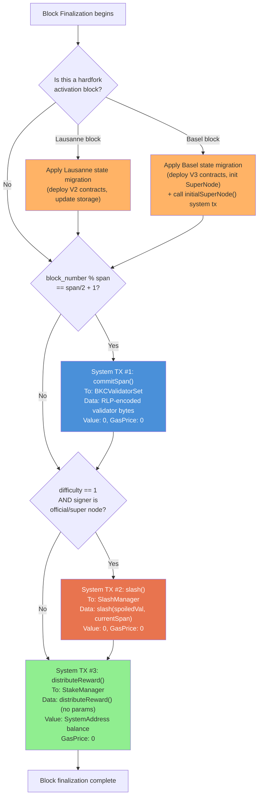
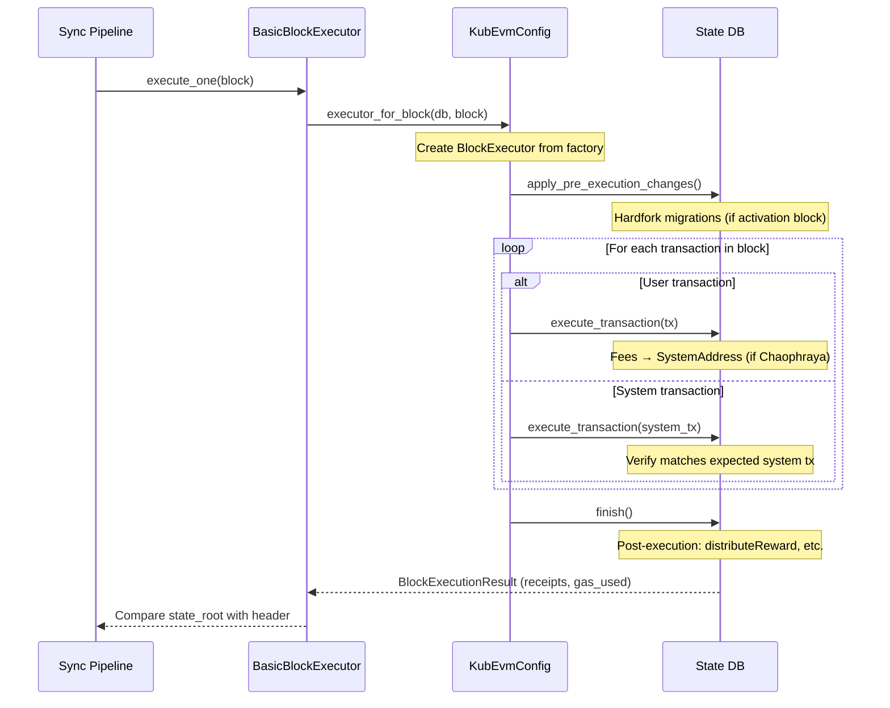
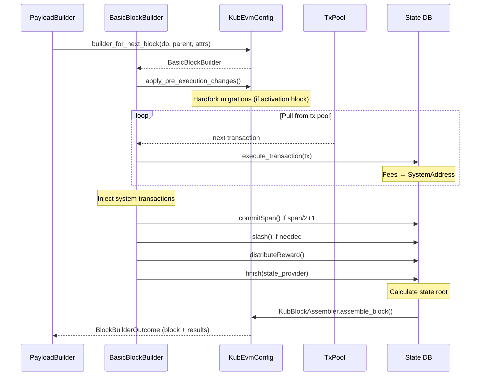

# Phase 4: Block Execution — Detailed Implementation Guide

## Overview

Phase 4 is about implementing the custom EVM execution pipeline for KubChain. This is the most critical phase because it controls **how blocks are executed and produced** — if anything is wrong here, state roots won't match and the chain breaks.

There are **5 major components** to implement, plus **2 hardfork state migrations** to port.

---

## What Reth Expects: The Trait Hierarchy



---

## Component 1: `KubEvmConfig` — The `ConfigureEvm` Implementation

**File to create:** `crates/kubchain/evm/src/lib.rs`

This is the primary entry point. It must implement ~10 methods.

### Associated Types

```rust
impl ConfigureEvm for KubEvmConfig {
    type Primitives = EthPrimitives;              // Reuse standard Ethereum types
    type Error = KubEvmError;                     // Custom error (or Infallible)
    type NextBlockEnvCtx = KubNextBlockEnvCtx;    // KubChain block attributes
    type BlockExecutorFactory = KubBlockExecutorFactory;  // Custom factory
    type BlockAssembler = KubBlockAssembler;       // Custom assembler
}
```

### Required Methods

| Method | Purpose | KubChain-specific logic |
|--------|---------|------------------------|
| `evm_env(header)` | Create EVM environment from existing header | Map block number to SpecId (capped at LONDON). Set chain_id, gas_limit, base_fee, etc. |
| `next_evm_env(parent, attrs)` | Create EVM environment for next block | Calculate next base_fee from parent. Determine SpecId from parent+1. |
| `context_for_block(block)` | Execution context for synced block | Extract parent_hash. KubChain has NO withdrawals, NO beacon root. |
| `context_for_next_block(parent, attrs)` | Execution context for block being built | Same but from attributes. Include span info, validator info. |
| `block_executor_factory()` | Return factory reference | Return `&self.executor_factory` |
| `block_assembler()` | Return assembler reference | Return `&self.block_assembler` |
| `tx_env(tx)` | Convert transaction to TxEnv | Standard conversion |
| `evm_with_env(db, env)` | Create EVM instance | Standard, use RethEvm |
| `builder_for_next_block(db, parent, attrs)` | Create block builder | Creates `BasicBlockBuilder` with our factory + assembler |
| `executor(db)` | Create block executor for sync | Creates `BasicBlockExecutor` wrapping our config |

### SpecId Mapping (Critical)

KubChain's EVM stays at London. The mapping:

```
Block number < Istanbul activation  → SpecId::ISTANBUL
Block number < Berlin activation    → SpecId::BERLIN
Block number >= London activation   → SpecId::LONDON
```

**Never** go above LONDON — no SHANGHAI, no CANCUN.

---

## Component 2: `KubBlockExecutorFactory` — Custom Execution Context

**File to create:** `crates/kubchain/evm/src/execute.rs`

The factory creates block executors with KubChain-specific execution context.

### Execution Context

```rust
/// KubChain-specific data available during block execution.
#[derive(Debug)]
pub struct KubBlockExecutionCtx<'a> {
    /// Parent block hash.
    pub parent_hash: B256,
    /// Snapshot of validator set at parent block.
    pub snapshot: &'a KubSnapshot,
    /// Chain spec for hardfork checks.
    pub chain_spec: &'a KubChainSpec,
    /// Current block signer (recovered from header extra-data).
    pub signer: Address,
}
```

### The Critical Part: `apply_pre_execution_changes()`

This is where KubChain's system operations happen. In bkc, these happen in `Finalize()`, but in reth's architecture they map to the executor's pre/post execution hooks.



### Fee Accumulation at SystemAddress

**This is the most critical custom behavior.** In standard Ethereum, gas fees go directly to the coinbase. In KubChain (after Chaophraya), fees go to `SystemAddress` instead.

In bkc this happens in `state_transition.go:337-345`:
```
IF Chaophraya is active:
    fees → SystemAddress (0xffffFFFfFFffffffffffffffFfFFFfffFFFfFFfE)
ELSE:
    fees → header.Coinbase (standard Ethereum behavior)
```

**In reth**, this needs to be handled via a custom reward strategy or by modifying how the beneficiary is set in the EVM environment. Options:

1. **Set `block_env.coinbase = SystemAddress`** in `evm_env()` when Chaophraya is active, then in `distributeIncoming()` move the balance to the actual validator. This mimics bkc's behavior.
2. **Custom `OnStateHook`** that intercepts fee payments.

**Option 1 is simpler and more correct** — it's exactly what bkc does at the EVM level.

---

## Component 3: System Transaction Injection

**File to create:** `crates/kubchain/evm/src/system_tx.rs`

System transactions are zero-gas transactions created by the consensus layer during block finalization. They are **not** in the mempool — they are deterministically generated.

### When Each System TX Fires



### System TX Construction Details

Each system transaction has these properties:
- **From:** `header.Coinbase` (current block producer)
- **GasPrice:** `0` (zero-gas)
- **Gas:** `MaxUint64 / 2` (~9.2 quintillion, effectively unlimited)
- **Nonce:** Sequential from sender's current nonce
- **Signed:** By the block producer's key (when mining) or verified against block txs (when validating)

#### TX 1: `commitSpan(bytes validatorBytes_)`
```
To:       BKCValidatorSet contract address
Value:    0
Data:     abi.encode("commitSpan", rlp_encode(validators))
Trigger:  block_number % span == span/2 + 1
```

The `validatorBytes` is an RLP-encoded array where each element is `(address, uint256 votingPower)`.

#### TX 2: `slash(address spoiledVal, uint256 currentSpan)`
```
To:       SlashManager contract address
Value:    0
Data:     abi.encode("slash", spoiled_validator_address, current_span_number)
Trigger:  difficulty == 1 AND signer is official/super node AND not already slashed
```

#### TX 3: `distributeReward()`
```
To:       StakeManager contract address
Value:    SystemAddress.balance (ALL accumulated fees)
Data:     abi.encode("distributeReward")  (no parameters, payable function)
Trigger:  ALWAYS (every block, if balance > 0)
```

**Before this tx:** `state.SetBalance(SystemAddress, 0)` and `state.AddBalance(coinbase, balance)`.
The function is called with `msg.value = balance` on the StakeManager.

### Validation vs Mining

When **validating** a received block:
- System txs are already in the block's transaction list
- The executor extracts them, regenerates expected system txs, and compares hashes
- If mismatch → block is invalid

When **mining/building** a new block:
- System txs are generated fresh and appended to the transaction list
- They are signed by the block producer

---

## Component 4: `KubBlockAssembler`

**File to create:** `crates/kubchain/evm/src/build.rs`

The assembler creates the final block from execution results. KubChain's assembler differs from Ethereum's in:

1. **Extra-data**: Contains validator list + system contracts at span boundaries
2. **No withdrawals**: withdrawals_root is always None
3. **No blob gas**: No EIP-4844 fields
4. **No beacon root**: No parent_beacon_block_root
5. **Difficulty**: Set to 2 (in-turn) or 1 (out-of-turn), not 0
6. **Nonce**: May have specific values (unlike post-merge Ethereum which uses 0)
7. **Uncle hash**: Always empty ommer root

```rust
fn assemble_block(&self, input: BlockAssemblerInput) -> Result<Block, BlockExecutionError> {
    let header = Header {
        parent_hash: ctx.parent_hash,
        ommers_hash: EMPTY_OMMER_ROOT_HASH,
        beneficiary: evm_env.block_env.beneficiary,
        state_root,                                    // From BlockBuilder.finish()
        transactions_root: calculate_transaction_root(&transactions),
        receipts_root: calculate_receipt_root(&receipts),
        logs_bloom: compute_logs_bloom(&receipts),
        timestamp: evm_env.block_env.timestamp,
        number: evm_env.block_env.number,
        gas_limit: evm_env.block_env.gas_limit,
        gas_used: *gas_used,
        difficulty: /* DIFF_IN_TURN or DIFF_NO_TURN */,
        extra_data: /* vanity + validators + contracts + seal */,
        mix_hash: B256::ZERO,
        nonce: B64::ZERO,
        base_fee_per_gas: Some(evm_env.block_env.basefee),

        // KubChain: These are always None/absent
        withdrawals_root: None,
        blob_gas_used: None,
        excess_blob_gas: None,
        parent_beacon_block_root: None,
        requests_hash: None,
    };

    Ok(Block { header, body: BlockBody { transactions, ommers: vec![], withdrawals: None } })
}
```

---

## Component 5: Hardfork State Migrations

**Files to create:** `crates/kubchain/evm/src/hardfork/lausanne.rs` and `basel.rs`

These are one-time state changes applied at specific block numbers. They deploy new contract bytecode and modify storage slots.

### Lausanne Migration

Applied at `LausanneBlock`. Modifies state directly (no transactions):

| Action | Contract | Details |
|--------|----------|---------|
| Deploy code | StakeManagerV2 | Replace bytecode at StakeManager address |
| Deploy code | StakeManagerStorageV2 | Replace bytecode at StakeManagerStorage address |
| Deploy code | SlashManagerV2 | Replace bytecode at SlashManager address |
| Set storage | StakeManagerStorage slot 24 | `soloSlashRate = 100` |
| Set storage | StakeManagerStorage slot 25 | `minimumPoolStake = 100_000 ether` |
| Set storage | StakeManagerStorage slot 26 | `minimumPoolDelegate = 100 ether` |
| Set storage | StakeManagerStorage slot 27 | `minimumSoloStake = 10 ether` |
| Set storage | StakeManagerStorage slot 28 | `SlashThreshold` (param) |
| Set storage | StakeManagerStorage slot 29 | `SlashEpochSize` (param) |
| Set storage | StakeManagerV2 slots 5-8 | Cross-references to other contracts |
| Set storage | SlashManagerV2 slot 3 | Reference to StakeManagerStorage |

### Basel Migration

Applied at `BaselBlock`. More complex — 5 contracts upgraded + SuperNode init:

| Action | Contract | Details |
|--------|----------|---------|
| Deploy code | StakeManagerV3, StakeManagerStorageV3, SlashManagerV3, NftContractV3, BKCValidatorSetV3 | Replace bytecode |
| Convert official→pool | StakeManagerStorage | Increment poolAmount, clear officialAmount |
| Init SuperNode | StakeManagerStorage | Set SuperNode address with activation block |
| Update references | All 5 contracts | Cross-reference storage slot updates |
| System TX | StakeManagerV3 | `initialSuperNode(validatorId, superNodeAddress)` |

### Implementation Pattern

```rust
pub fn apply_lausanne_hardfork(
    state: &mut impl StateProvider,
    chain_spec: &KubChainSpec,
) {
    // Deploy new bytecode
    state.set_code(stake_manager_addr, STAKE_MANAGER_V2_BYTECODE.into());
    state.set_code(stake_manager_storage_addr, STAKE_MANAGER_STORAGE_V2_BYTECODE.into());
    state.set_code(slash_manager_addr, SLASH_MANAGER_V2_BYTECODE.into());

    // Update storage slots
    state.set_storage(stake_manager_storage_addr, U256::from(24), U256::from(100));
    state.set_storage(stake_manager_storage_addr, U256::from(25),
        U256::from_str("0x152D02C7E14AF6800000").unwrap()); // 100_000 ether
    // ... etc
}
```

The actual bytecodes must be extracted from the bkc source (`consensus/clique/hardfork/lausanne/` and `basel/` directories).

---

## Execution Flow: Syncing a Block vs Building a Block

### When Syncing (validating a received block)



### When Building (producing a new block)



---

## Files to Create / Modify

| File | Purpose | Complexity |
|------|---------|------------|
| `crates/kubchain/evm/src/lib.rs` | `KubEvmConfig` implementing `ConfigureEvm` | HIGH |
| `crates/kubchain/evm/src/execute.rs` | `KubBlockExecutorFactory`, `KubBlockExecutionCtx`, system tx injection | HIGH |
| `crates/kubchain/evm/src/build.rs` | `KubBlockAssembler` implementing `BlockAssembler` | MEDIUM |
| `crates/kubchain/evm/src/system_tx.rs` | System transaction builders (commitSpan, slash, distributeReward) | MEDIUM |
| `crates/kubchain/evm/src/spec.rs` | SpecId mapping (block number → ISTANBUL/BERLIN/LONDON) | LOW |
| `crates/kubchain/evm/src/hardfork/mod.rs` | Hardfork migration dispatcher | LOW |
| `crates/kubchain/evm/src/hardfork/lausanne.rs` | Lausanne state migration | MEDIUM |
| `crates/kubchain/evm/src/hardfork/basel.rs` | Basel state migration | HIGH |
| `crates/kubchain/contracts/src/caller.rs` | `SystemContractCaller` (EVM-based contract calls) | MEDIUM |

---

## Key Decisions Needed

### 1. Fee Routing Strategy
**Option A (Recommended):** Set `block_env.coinbase = SystemAddress` when Chaophraya is active, then in finalization move balance to validator + call distributeReward.
**Option B:** Custom revm handler that intercepts fee payments.

### 2. System TX Handling During Sync
**Option A (Recommended):** During sync, system txs are already in the block. Execute them normally but verify they match expected values.
**Option B:** Strip system txs from the block, re-generate them, and compare.

bkc uses Option B (strips and re-generates in `state_processor.go:86-105`).

### 3. Hardfork Bytecodes
The actual contract bytecodes for Lausanne/Basel migrations need to be extracted from bkc as hex constants. These are large (potentially hundreds of KB). Options:
**Option A:** Embed as `const` byte arrays in Rust source
**Option B:** Load from files at compile time via `include_bytes!()`

### 4. BlockExecutorFactory Reuse
**Option A:** Use `EthBlockExecutorFactory` from alloy_evm and customize only the execution context.
**Option B:** Create a fully custom `KubBlockExecutorFactory`.

Option A is simpler if the standard execution flow works with our `apply_pre_execution_changes` customization.

---

## Source Files Reference

### bkc (what to port)
| Logic | File | Lines |
|-------|------|-------|
| Finalize (post-block) | `consensus/clique/clique.go` | 819-938 |
| FinalizeAndAssemble | `consensus/clique/clique.go` | 942-1018 |
| distributeIncoming | `consensus/clique/clique.go` | 1143-1155 |
| commitSpan | `consensus/clique/clique.go` | 1157-1176 |
| slash | `consensus/clique/clique.go` | 1116-1140 |
| Fee routing to SystemAddress | `core/state_transition.go` | 337-345 |
| System tx construction | `consensus/clique/contract/client.go` | 573-647 |
| IsSystemTransaction | `consensus/clique/clique.go` | 268-285 |
| Block processing + system tx separation | `core/state_processor.go` | 74-115 |
| Lausanne migration | `consensus/clique/hardfork/lausanne/instruction.go` | All |
| Basel migration | `consensus/clique/hardfork/basel/instruction.go` | All |

### kub-reth (reference implementations)
| Pattern | File |
|---------|------|
| ConfigureEvm trait | `crates/evm/evm/src/lib.rs` (line 184+) |
| Ethereum ConfigureEvm | `crates/ethereum/evm/src/lib.rs` (line 127+) |
| BlockAssembler trait | `crates/evm/evm/src/execute.rs` (line 202+) |
| EthBlockAssembler | `crates/ethereum/evm/src/build.rs` (line 30+) |
| Payload builder flow | `crates/ethereum/payload/src/lib.rs` (line 138+) |
| Optimism ConfigureEvm | `crates/optimism/evm/src/lib.rs` (line 119+) |
| Type aliases | `crates/evm/evm/src/aliases.rs` |
